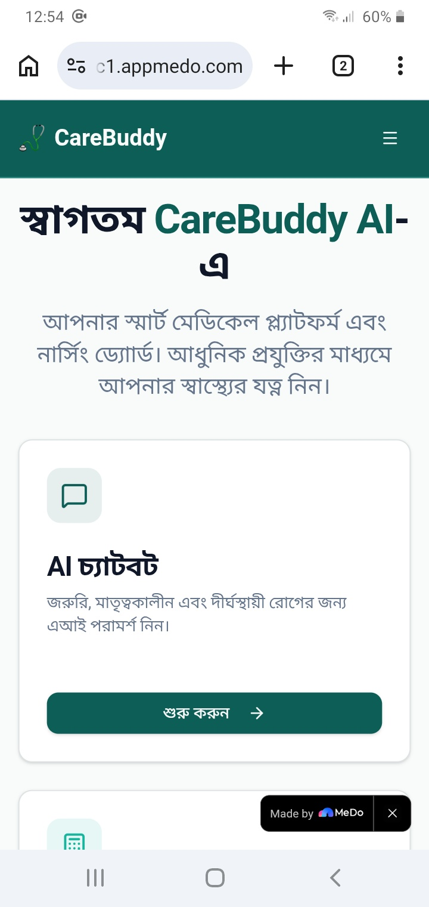
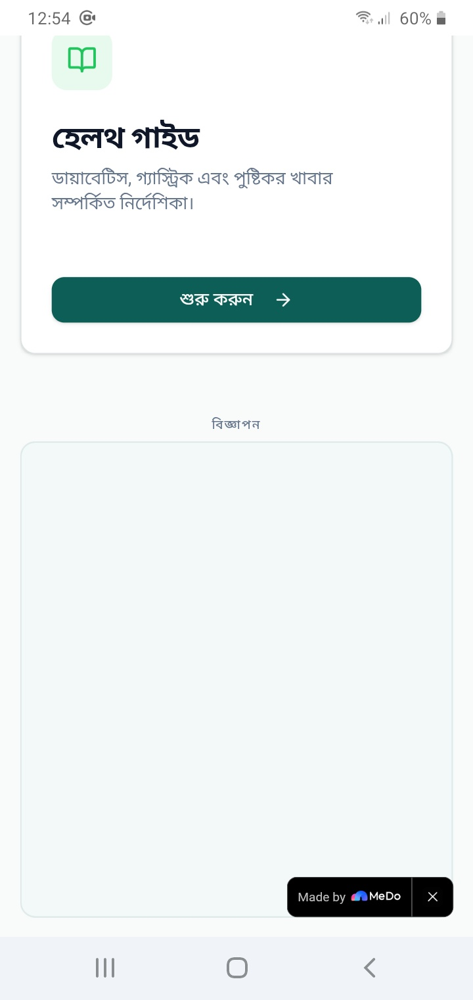

# CareBuddy AI 🩺✨

CareBuddy AI is a smart medical platform and comprehensive nursing dashboard designed to deliver personalized health insights, first-aid solutions, and vital calculators entirely in Bengali. 

Built with a clean **Clinical Mint-Green & Clean White** theme, this application bridges the gap between conversational AI, nursing logic, and long-term project sustainability.

---

## 🚀 Live Demo & Infrastructure
* **Live Deployment:** [https://app-by6npjuct1c1.appmedo.com/?s=s?s=s]
* **Repository Architecture:** Monolithic Web Prototype
* **Development Environment:** Acode (Optimized for lightweight, mobile-first compilation)
## 🎬 Submission Video Demo

*(Click the image above to watch our project demonstration on YouTube)*

---

## ✨ Features & Module Architecture

### 1. 🤖 Multi-Domain AI Chatbot
Powered by the **Google Gemini API via Vertex AI Studio**, the conversational agent delivers safe, localized, and professional nursing guidance across three strict domains: Emergency Care, Maternal Care, and Chronic Disease management.

### 2. 📊 Health Calculators & 📖 Curated Health Guides
Includes standard BMI/BMR dynamic evaluation tools with strict input validation and interactive, static resources for conditions like Diabetes, Gastric issues, and nutrition.

---

## 💻 Interface & Visualization

| 📱 Main Dashboard View | 💵 AdSense Placement (Fallback) |
|:---:|:---:|
|  |  |
| *The clinical user interface showcasing the Bengali AI Chatbot module entry point.* | *The dedicated Google AdSense revenue slot with CSS fallback container at the footer.* |

---

## 📈 Monetization & Sustainability Framework
> 💡 **Google AdSense Implementation Attempt:**
> A core milestone of this prototype was establishing a solid financial infrastructure for long-term project viability. We have successfully implemented a dedicated **Google AdSense architecture** within the codebase (`Publisher ID: pub-7482303859667884`, `Ad Slot ID: 9064540213`). 
> 
> Due to the temporary constraints of a free-tier hosting sub-domain during the hackathon phase, live ads are undergoing domain validation. However, as demonstrated in the visual layout above, the alternative placeholder CSS structure ensures zero layout shifts and keeps the application completely production-ready for immediate monetization upon custom domain migration.

## 💰 Micro-transaction Validation: 
Successfully generated early MVP revenue of 100 BDT ($0.85 USD) from an early-stage user for custom symptom screening validation.

---

## 🔮 Future Roadmap
* [ ] Migration to a Top-Level Custom Domain (`.com` / `.xyz`).
* [ ] Finalizing AdSense Review Verification.
* [ ] Database persistence for user registration and Electronic Health Records (EHR).
